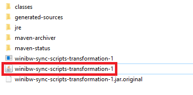
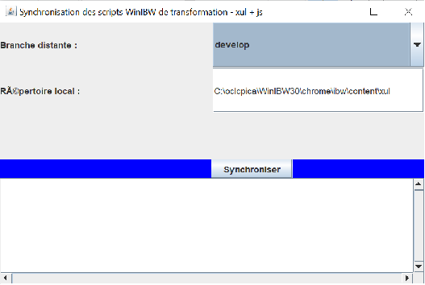

# winibw-scripts
Scripts utilisateurs WinIBW

Pour ajouter un des scripts du dépôt, il faut éditer le fichier : C:\oclcpica\WinIBW30\Profiles\<nom_utilisateur>\winibw.vbs sur votre poste, contenant WinIBW.

# Logiciels de synchronisation des scripts

- Téléchargez les logiciels de synchronisation :
- Logiciel de synchronisation des scripts de création : https://cloud.abes.fr/index.php/s/fdg3ZWR3SNq5s6W
- Logiciel de synchronisation des scripts de transformation : https://cloud.abes.fr/index.php/s/9scoPa8bpsdMnSX
- Dézippez le dossier puis lancer comme ci-dessous le programme (exemple avec celui des fichiers xul + js)



- Cliquez sur synchroniser (en utilisant la branche éventuelle qui vous sera spécifiée, par défaut develop)



- Dans le cas ci-dessus cela mettra automatiquement à jour vos scripts de transformation situés dans le répertoire 
- C:\oclcpica\WinIBW30\chrome\ibw\content\xul
- Les fichiers existants de même nom seront écrasés automatiquement la MAJ est automatique

# emplacement des versions de winibw (hors self service wapt)
P:\SUDOC\logiciels_Pica\WinIBW\WinIBW3\

actuelle

P:\SUDOC\logiciels_Pica\WinIBW\WinIBW3\WinIBW3_2_5\prod -> version 3.2.5.5

# attention emplacement spécifique des scripts [ancienne procédure ne plus tenir compte]

Quand à la synchronisation, vous avez des fichier XXXXXX.js accompagné d'un fichier XXXXXX.xul, pensez à couper coller ces fichiers 
à partir de (repertoire d'origine) -> C:\oclcpica\WinIBW30\scripts\
vers (répertoire de destination) -> C:\oclcpica\WinIBW30\chrome\ibw\content\xul

## débogage

Afficher une zone

Dans les fichiers de scripts js, faire par exemple pour afficher la zone 003

```js
var resultat = application.activeWindow.title.findTag("003", 0, false, true, true);
prompts.alert(null, "resultat", resultat);
```

Important : si prompts.alert ne fonctionne pas et fait planter winibw utiliser uniquement 

```js
alert(variable) ou alert("message" + variable)
```

Afficher un message (pour voir si le code s'execute et passe à un endroit)

```js
prompts.alert(null, "passeici", "ce qui s'affichera à l'écran" + variableEventuelle + "de l'affichage texte à nouveau");
```

La variable en troisième paramètre

Ajout de zone (à vérifier)

```js
// ajout de "103 ##$a\n"
application.activeWindow.title.endOfBuffer(false);
application.activeWindow.title.insertText("103 ##$a\n");

function supprimer(zone)
{
	application.activeWindow.title.startOfBuffer (false);
	var res = application.activeWindow.title.findTag (zone, 0, true, true, false);
	while (res != "")
	{
		application.activeWindow.title.deleteLine(1);
		res = application.activeWindow.title.findTag (zone, 0, true, true, false);
	}
}
function ajouter(zone)
{
	application.activeWindow.title.endOfBuffer (false);
	application.activeWindow.title.insertText (zone + "\n");
}
```

# winibw-sync

Winibw sync est un outil permettant de synchroniser des script distants présents sur le dépôt github sur les postes en local des utilisateurs ou se situent leur installation classique de leur winibw local
(voir guide utilisation et compilation du programme) situé dans le répertoire documentation pour apporter si nécessaire des modifications logicielles